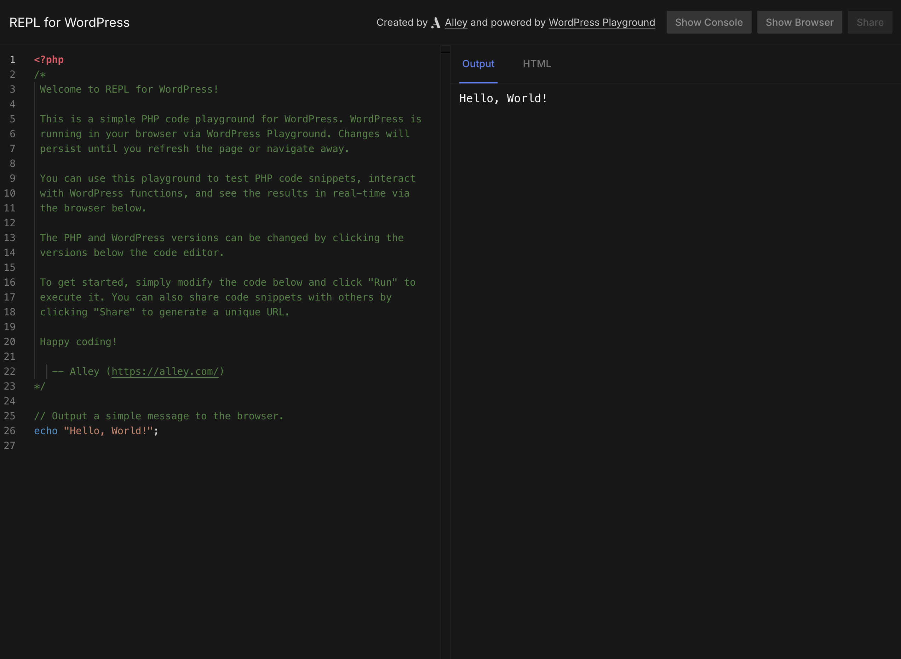

# REPL for WordPress

An online REPL for WordPress that allows you to test and run PHP code snippets in a WordPress environment.

[](https://repl.alley.dev)

> [repl.alley.dev](https://repl.alley.dev)

## Features

- **Interactive PHP Code Editor**: Write and test PHP code with syntax highlighting and WordPress function autocomplete
- **WordPress Playground Integration**: Runs WordPress directly in your browser via [WordPress Playground](https://wordpress.github.io/wordpress-playground/)
- **Plugin & Theme Installation**: Install WordPress plugins and themes directly from the WordPress.org repository via URL query parameters
- **Version Selection**: Choose specific PHP and WordPress versions for testing
- **Multisite Support**: Test code in a WordPress multisite environment
- **Code Sharing**: Generate shareable URLs to share code snippets with others

## Query Parameters

You can customize the WordPress environment using URL query parameters, similar to [WordPress Playground's Query API](https://wordpress.github.io/wordpress-playground/developers/apis/query-api/):

### Plugin Installation

Install plugins from the WordPress.org repository by using the `plugin` parameter. You can install multiple plugins by repeating the parameter:

```
https://repl.alley.dev/?plugin=hello-dolly
https://repl.alley.dev/?plugin=woocommerce&plugin=akismet
```

### Theme Installation

Install themes from the WordPress.org repository using the `theme` parameter:

```
https://repl.alley.dev/?theme=twentytwentyfour
https://repl.alley.dev/?theme=twentytwentyfour&plugin=hello-dolly
```

## Credits

This project is actively maintained by [Alley
Interactive](https://github.com/alleyinteractive). Like what you see? [Come work
with us](https://alley.com/careers/).

- [Sean Fisher](https://github.com/srtfisher)
- [All Contributors](../../contributors)

## License

The GNU General Public License (GPL) license. Please see [License File](LICENSE) for more information.
